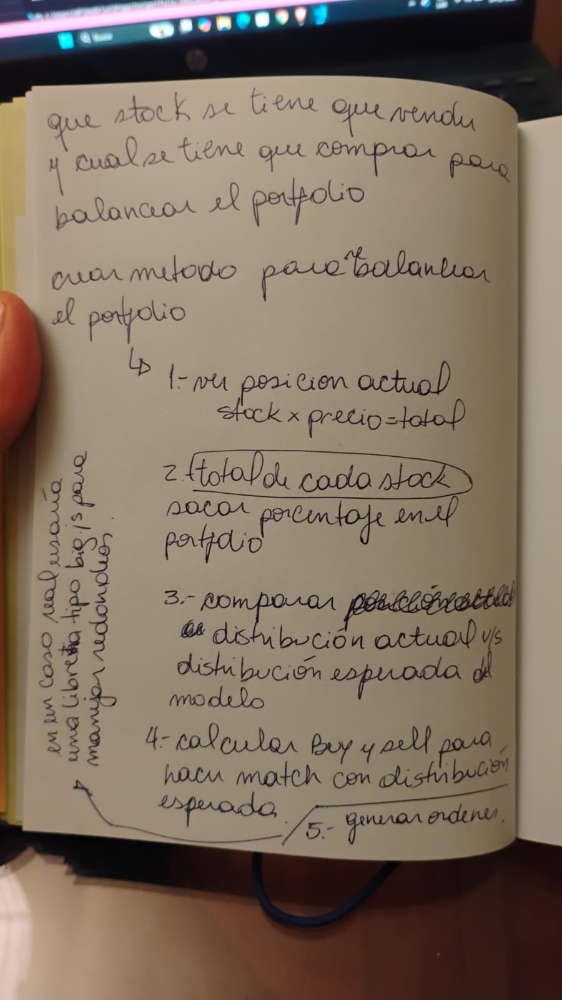

# Portfolio Rebalance (Node.js)

Simple exercise implementing a Portfolio that holds Stocks and generates rebalance orders based on target allocations.

## Prework - Understanding the requirements

First I write down my understanding of the task, to then separate it in steps to make the exercise more manageable. Here is a picture of my initial notes as part of that process. 📓✏️
<p align="center">
  
</p>


## Approach

1. The portfolio calculates the current allocation of each stock based on its market value.
2. Current allocations are compared to expected allocations.
3. If the difference is negative, a buy order is generated.
4. If the difference is positive, a sell order is generated.
5. If the difference is equal to zero, no orders are generated.

## LLM chat usage.

I used ChatGpt as a support tool during the implementation, mainly to validate calculations and logic after defining the core classes and methods. The task was approached incrementally, using my prior analysis to guide each step and manually adjusting the generated code as needed.

Here is a link to the chat:
[link](https://chatgpt.com/share/6983e801-6908-8001-b409-2b3a7355d909)

## Requirements

- Node.js >= 18

## Run

```bash
npm install
npm start
```
